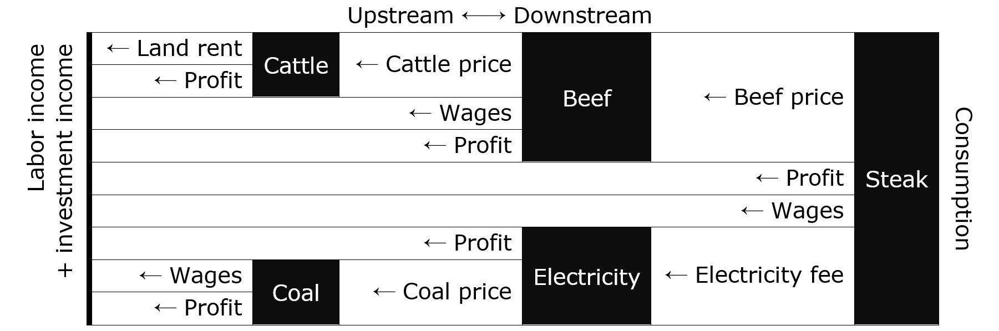
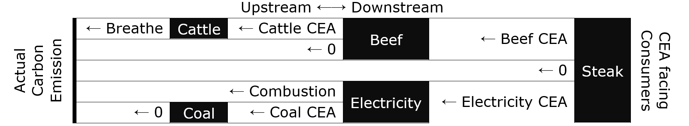

# Carbon emission accounting

## Introduction
I want to see two numbers on a price tag: the dollar price and the total amount of carbon emission this product is responsible for. 

Here is why. Many "Green life tricks" circulating on the internet are unscalable; some even lead to net-negative outcomes. We need to know the *magnitude* of carbon emission related to our activities, so that we can weight our efforts accordingly. A "$ + Carbon" price tag will inform us to make better decisions as consumers. Once our will to fight global warming is reflected in the market demand, the industries will have to listen. 

I can think of a way to acheive that, and it is:  

- Decentralized,  
- A natural extension to the logic of economy.  

## Analogy to the Laminar Money Flow
<!-- First, let's take a step back and look at how Capitalism allocates resource:  
* How people allocate time between work and leisure. 
* How people allocate investment among opportunities. 
* How people allocate consumption among goods and services. 

They corresponds to three markets: the labor market, the capital market, and the consumer market. Note that the economy optimization is a global task, yet under good institutions and laws a system where every agent solves their local optimization problem usually leads to good global outcomes.   -->
Optimizing economy growth is a *global* problem. If an intelligent agent is to solve it, she needs to be an all-seeing god. However, human intelligence is *distributed*. Is there a way to hierarchically sub-divide the problem into small parts for the 7.5 billions of us? Meet the *free market* where *local* optimization usually leads to good *global* outcomes.  

Similarly, to minimize carbon emission, we want to hierarchically distribute the responsibility and the incentives. My proposal is *carbon emission accounting*. To explain it, let me first show you its analogy in the existing world: the laminar money flow.  

  

(Technical detail: amortize any lump-sum investment.)  

The above diagram shows a simplified example of the laminar money flow. Notice the balance of money flux: for each firm (black box), `revenue = costs + profits`; and for the economy (entire diagram), `consumption = income`. However, the one thing I want to show you here is the below equality that holds true for all goods and services:  

```
price to downstream = price from upstream + value added
```

This recursively prunes complexity! The downstream firms only have to know the downstream prices that they face. For example, diners don't know the coal prices when they order steak at a restaurant. As promised, every firm can be a local optimizer - doing only *its* part of information processing and passing distilled information to other firms. The balance of money flux, or as I call it, the laminar nature of money flow, prevents double counting or loss of incentive during the propagation.  

## Laminar CEA Flow
Why not track carbon emission in the same way? Just like how everything, including intermediate goods, is priced with a dollar amount, let's attach a Carbon Emission Amount (CEA) to everything. For every firm, the CEA of a piece of product should be the sum of all its input materials' CEA *plus* the amount of carbon dioxide emitted by this firm because of this piece of product.  

```
CEA to downstream = CEA from upstream + CEA added
```
Using the steak example:  
  

The laminar nature of CEA flow prevents double counting or loss of CEA. Also notice that not all firms add CEA to products: few firms need to measure their carbon emission, while most firms only need to compute their products' CEA from the input materials' CEA and the amortized CEA of equipments. This is why it's called carbon emission *accounting*. In the end, the CEA that consumers see equals the actual amount of carbon emission the goods and services are responsible for.  

Price tags will look like: "$50, CEA 20mL". We will know the *magnitude* of carbon emission related to our activities, enabling us to weight our carbon-cutting efforts accordingly.  

## Discussions
* To facilitate CEA transfer between firms, we can use a block chain or a centralized bookkeeper.  
* The challenge will be to induce faithful `CEA added` reporting. This may require active external supervision. This is also where the analogy breaks - making money does not require active supervision.  
* Another analogy-breaking difference lies in the direction of constraint in the equation `X to downstream = X from upstream + X added`. In one, the free variable is `value added` and in the other, the free vaariable is `CEA to downstream`.  

## Feedback and Suggestions
* If you have feedback or suggestions for me, or  
* If I am wrong as hell, or  
* If you know how to make this happen sooner,  

Please tell me at daniel.chin@nyu.edu  
