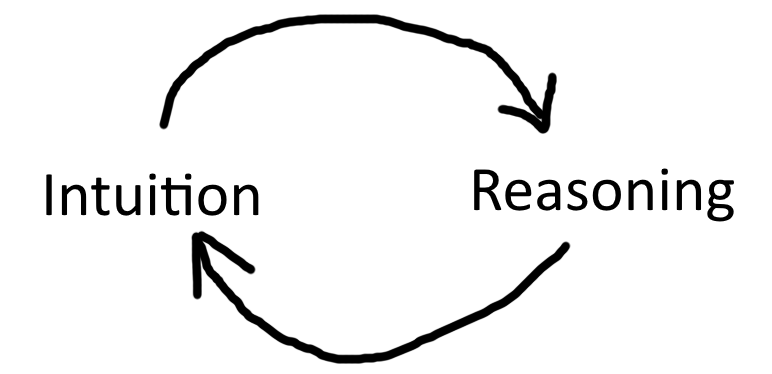

# Intuition and Reasoning
General intelligence 可能是 intuition + reasoning. Intuition 类似 neural network, 它 data-hungry 并且 generalize things in a way not necessarily reasonable. It's where our biases lie. Reasoning 类似 formal system, 它dumb, but potentially infinite. 人在思考的时候，intuition 和 reasoning 互相 update.  
  
When one first learns about 相对论，it is probably not intuitive. But it is reasonable. As you train yourself, 相对论 becomes intuitive, and you may now generalize your intuition to other things with cool results. 反过来，人在一步一步推理的时候，会用 intuition 做 sanity check. 似乎，找到 intuition 和 reasoning 之间的桥，会有助我们开发 artificial general intelligence.  
