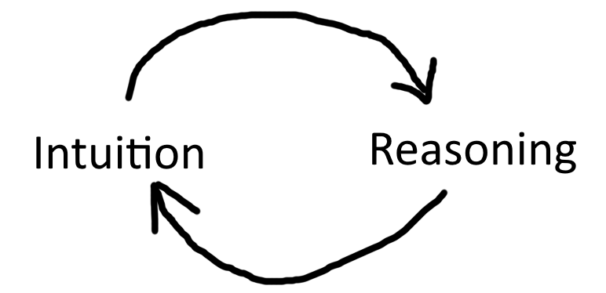

# Intuition and Reasoning
General intelligence 可能是 intuition + reasoning. Intuition 类似 neural network, 它 data-hungry 并且 generalize things in a way not necessarily reasonable. It's where our biases lie. Reasoning 类似 formal system, 它dumb, but potentially infinite. 人在思考的时候，intuition 和 reasoning 互相 update.  
  
When one first learns about 相对论，it is probably not intuitive. But it is reasonable. As you train yourself, 相对论 becomes intuitive, and you may now generalize your intuition to other things with cool results. 反过来，人在一步一步推理的时候，会用 intuition 做 sanity check. 似乎，找到 intuition 和 reasoning 之间的桥，会有助我们开发 artificial general intelligence.  

## How humans identify odd time signature
You must have had similar experiences: while mindlessly listening to music on the metro, suddenly a part of your brain asks: "Wait, is this odd time signature?" And then your conscious mind checks the music and finds that it indeed is. 

Here is how I feel my brains work. A time signature classifier is always on - this takes no mental effort. Its output layer has several neurons corresponding to common time signatures (2/4 (literally), 3/4, 4/4, etc.). Their activation is the confidence. This structure is evident because when a piece suddenly tells you "I'm in 3/4, not 4/4 as you previously thought, haha!" you instantly switches to 3/4 and the last part of the piece, in your sensory memory, makes sense to you as 3/4 now. In other words, multiple simultaneous parsing attempts are in parallel. 

Whenever *all* of the output neurons are of low activation, that's when your gut feeling goes "hey, are we hearing odd time signature?" And then you consciously check. Then you conclude "It's 12/4" or "It's 5/4". The process of conscious checking is more algorithmic and less NN-based. 

So you can see the distinction between *thinking* and *feeling* by looking at how humans classify time signatures. 
