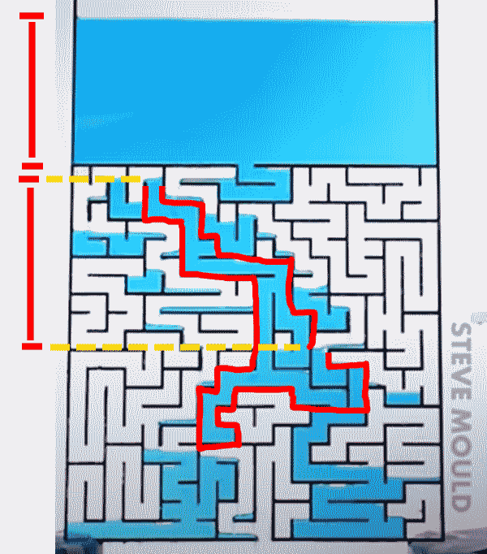

# Water solving mazes

Steve Mould made a wonderful video "Can water solve a maze?":  
[https://youtu.be/81ebWToAnvA](https://youtu.be/81ebWToAnvA)  
At [5:50](https://youtu.be/81ebWToAnvA?t=350) Steve said the tank still had water left in it even when the water flow stopped because the aggregate surface tension stopped the water. However, I wish to point out the main factor balancing with gravity here is probably the self-weight of water in the maze. 

The highlighted part in the above illustration is pulled down by gravity. It has two ends. There is a height difference, and consequently a pressure difference, between those two ends. It essentially "pushes back" against the water in the tank.  
