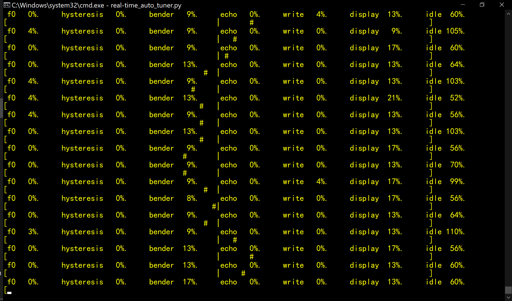
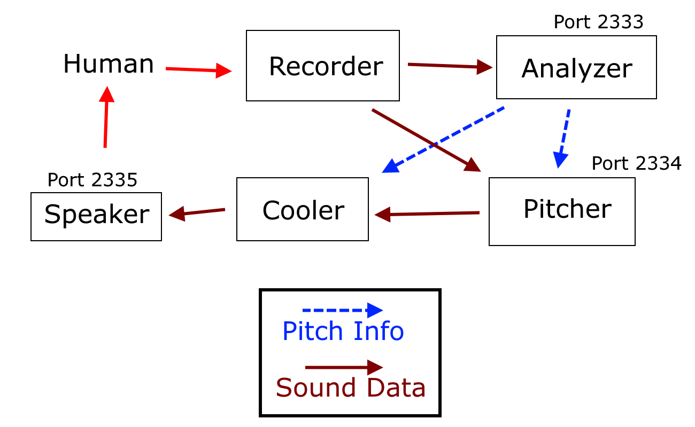
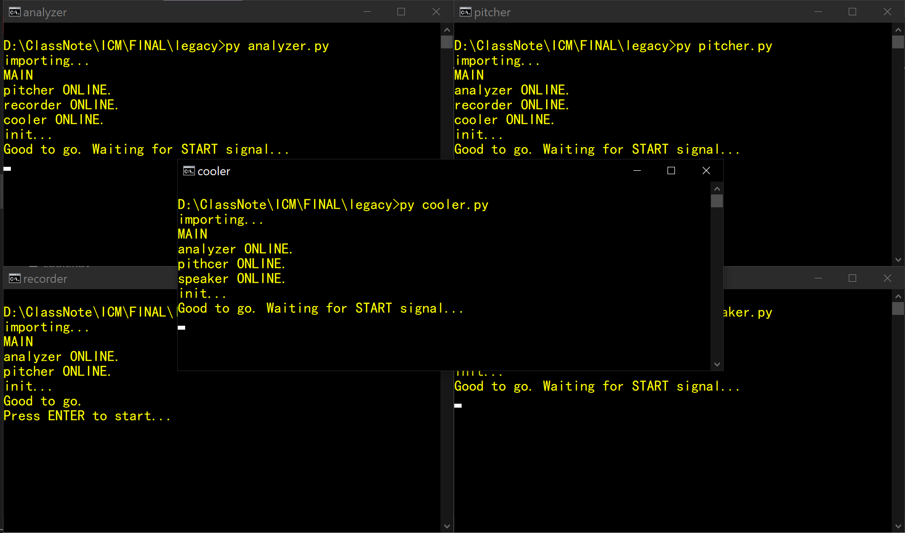

# Real-time Auto tuner
Sing into the computer. The computer rounds your pitch to the nearest 12-tone-valid pitch, and plays it out with the speakers.  

This was the final project for Intro to Computer Music @ NYU Shanghai, supervised by Gus Xia. Collaborators: Evan Ma, Saili Yao.  

During that semester, however, we could not assail the real-time pitch detection part. I picked this project back up after doing the real-time pitch detection project (https://github.com/Daniel-Chin/Real-time-Benchmarking-of-Pitch-Estimators).  

I modified the YIN code in Librosa to make it frame-based and real-time.  

Audio IO uses PyAudio.  

## Screenshot

The position of "#" relative to the "|" visualizes the pitch error.  
The program also displays a runtime diagnosis (time profiling) of various steps in the algorithm. Positive "idle" time means the program is processing audio faster than it is generated. For more info, see section "**Latency breakdown**" below.  

## Parameters
Talking about the parameters is a nice way to introduce the various features. Let's go.  

### CONFIDENCE_TIME
Default is `.00001`

Larger values will 1) make netural speech less artificial, and 2) dampen the otherwise-immediate pitch correction, which sometimes sounds too digital.  

**How it works**: The algorithm has a `confidence` state. `confidence` is set to `0` each time the pitch changes. `confidence` accumulates as the singer stays in the same pitch. This feature makes the algorithm basically do nothing when the singer is swiping over a big range of pitches.  

### HYSTERESIS
Default is `.2`

This feature makes the algorithm prefer to sustain its previous pitch classification instad of re-classify. For example, if the singer is at C half sharp, because of the natural instability of their voice, the detected pitch will fluctuate. If I simply used a frame-wise rounding scheme, the classification will jump eratically between C and C#, giving the singer a confusing response. Using this hysteresis feature, we are like "ok, maybe we can never know whether it truly is C or C#; but once we called one of them, sustain the classification so the singer knows what's going on."  

Values lower than `.2` leads to eratic jumps when the vowel and pitch registration are challenging. Values higher than .2 makes the singer feel significant "drag" - as if the algorithm is fighting their pitch movement, especially during chromatic ascent or descent. It... felt really interesting.  

### FRAME_LEN
Default is `1024`

Higher values lead to better pitch estimation accuracy but longer latency.  

### CROSS_FADE
Default is `0.04`

They way I pitch bend the voice is to resample (stretch) the audio frame and either repeat or trim part of it so that its size is correct. This leads to hard concatenation of non-continuous audio, creating noise. Therefore I added the **within-frame crossfade** feature. It uses linear crossfade to smooth the transition within each frame.  

This parameter controls what portion of a frame will overlap and thus crossfade. There is a tradeoff between noise reduction and "artificial vibrato". Values higher than `0.04` create audible AM modulation (at a frequency of 40Hz under `FRAME_LEN=1024`).  

### DO_ECHO
Default is `false`

I thought an echo effect whose period is exactly the IO latency would make the latency less noticable. It did not. So I disabled this feature.  

## Latency breakdown
The overall latency of this real-time auto tuner on my laptop is ~130ms. Here is a breakdown.  

1. The `FRAME_LEN` is 1024. Under `sample_rate=44100`, a frame will be 23ms. Because a frame needs to be complete before it can be analyzed, this creates a latency of 23ms. There is a theoretical impossibility to have both *low latency* and *pitch estimation resolution* - it's the Heisenberg's uncertainty principle.  
2. Pitch detection with YIN takes <1ms.  
3. Hysteresis algorithm takes ~0ms.  
4. Pitch bend with Resampy and crossfading take ~3ms.  
5. Writing to the output buffer of PyAudio sometimes takes <1ms.  
6. Printing pitch information and time profiling reports to the terminal takes ~4ms.  
7. The rest of the latency, ~98ms, is not my problem. Probably hardware, OS, or PyAudio.  

## Legacy
The project was originally implemented with five processes, aiming to maximize multi-core CPU usage. There was also a "Cooler" that made the audio sound cool (echo special effect) if the singer was on pitch.  

It was completely unecessary. On the bright side, it made me look pretty hard-core when I ran it!  

